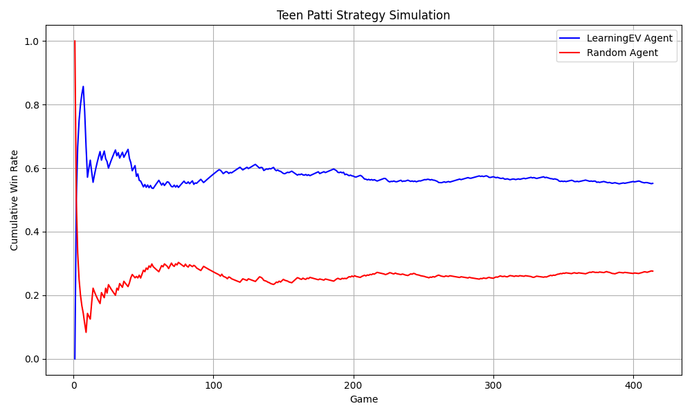

# Teen Patti Strategy Simulator

This project simulates the Indian card game **Teen Patti** using Monte Carlo simulations and Expected Value (EV) based strategies. It is designed as a multi-agent simulation framework to compare different strategies and analyze win probabilities.

---

## Features

- **Monte Carlo Estimation:** Calculates win probabilities for hands by simulating multiple game outcomes.
- **EV Agent:** Makes fold/play decisions based on Expected Value calculations.
- **Learning EV Agent:** Adaptive agent that adjusts its play/fold threshold over time based on past results.
- **Random Agent:** Baseline agent that randomly decides to play or fold.
- **Multi-Agent Simulation:** Run thousands of games to compare strategies.
- **CSV Output & Plotting:** Saves simulation results to CSV and generates plots showing cumulative win rates over games.

---

## Folder Structure

```

teen-patti-simulator/
│
├─ src/
│  ├─ game/
│  │  ├─ deck.py
│  │  └─ game_engine.py
│  ├─ probability/
│  │  ├─ monte_carlo.py
│  │  └─ hand_evaluator.py
│  ├─ agents/
│  │  ├─ base_agent.py
│  │  ├─ ev_agent.py
│  │  ├─ learning_ev_agent.py
│  │  └─ random_agent.py
│  └─ simulator/
│     ├─ simulation_runner.py
│     └─ enhanced_simulation_runner.py
├─ main.py
└─ README.md

````

---

## Installation

1. Clone or download the repository.
2. Install dependencies (if not already installed):

```bash
pip install matplotlib
````

---

## Usage

Run the main simulation:

```bash
python main.py
```

* The default simulation runs **500 games** between the EV agent and Random agent.
* Generates **cumulative win rate plot** and saves results to `simulation_results.csv`.
* Switch to `LearningEVAgent` in `enhanced_simulation_runner.py` for adaptive strategy simulation.

---

## Example Output

```text
Final EV Agent win rate: 55.20%
Final Random Agent win rate: 27.60%
```



---

## How It Works

1. **Deck & Hands:** The deck is shuffled and hands are dealt to each agent.
2. **Monte Carlo Simulation:** For each hand, multiple simulated games estimate the probability of winning.
3. **EV Calculation:** Agents compute Expected Value (EV) for their hand and decide to play or fold.
4. **Adaptive Strategy:** The Learning EV Agent updates its decision threshold based on recent wins/losses.
5. **Multi-Agent Simulation:** Runs thousands of games to analyze win rates across different strategies.
6. **Results & Visualization:** Saves cumulative win rates to CSV and plots performance over time.

---

## Contribution

This project can be extended by:

* Adding new agent strategies
* Simulating more than two agents per game
* Implementing additional metrics like pot size analysis, risk adjustment, or advanced reinforcement learning strategies
